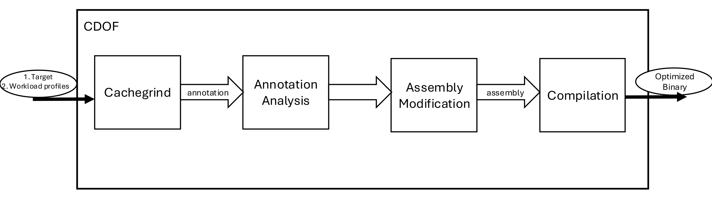

# Introduction

CDOF is a profile-guided optimization framework for C programs. CDOF identifies delinquent loads in the source code -- deliquent loads being the set of loads "that are responsible for the vast majority of memory stall cycles" (collins et el). This is achieved by using the commonly used profiler *cachegrind* to characterize a given program on different workload sizes. Once these delinquent loads have been identified, prefetch instructions are inserted at the appropriate places. Our results show that in some cases, a CDOF-optimized binary can have up to a four percent improvement in last-level cache miss rates. However, an overall increase in runtime has been observed in the general case.

# Design of CDOF

### Design Changes

The initial proposed implementation of CDOF is different from the final version of CDOF. The current version of CDOF is not a dynamic framework that completes optimizations during the lifetime of a program, but rather it is a post-mortem optimizer.

In other words, optimizations to the binary of the target program occur after a program has completed, as opposed to during its execution. One of the immediate benefits of post-mortem optimization is that there is no incurred overhead during execution due to the process of optimizing itself. Moreover, in the proposed version of CDOF, optimized code segments would be placed within an *execution trace buffer* to prevent self-modifying code, whereas in post-mortem optimization, optimized code segments can simply be inlined into the binary.

### Running CDOF

As shown in the process flow diagram in Figure 2 (page 2), CDOF takes in two arguments as input: Target assembly (i.e. program to optimize) and a text file called a 'workload profile'. 

CDOF aims to identify sources of delinquent loads in the target and eliminate said delinquent loads by inserting software prefetch instructions. CDOF is able to identify sources of delinquent loads within a program by analyzing different program input workloads. The idea is that many different runs with diverse problem inputs allow CDOF to converge to a strong belief of the set of delinquent loads within a program. Hence the workload profile contains these different runs of different problem instances.

For instance, the workload profile 'workload_profiles.txt' in Figure 1 is for a matrix multiplication program `gemm.o` where each line is a different instance of gemm. Ideally, a workload profile provides enough coverage such that profiling reveals where in the program a bottleneck is occurring due to memory access latency.

\begin{figure}[tb]
\centering
\subfloat[profile\_workloads.txt]{\includegraphics[width=.4\columnwidth]{workloads.png}} \quad
\caption[A number of pictures.]{Example of a workload profile given to CDOF} % The text in the square bracket is the caption for the list of figures while the text in the curly brackets is the figure caption
\label{fig:workload}
\end{figure}

### Design Details

Figure 2 illustrates the process flow diagram of CDOF. In CDOF, cachegrind is used to characterize memory access performance with respect to each line of the source file -- this is referred to as an annotation.  In annotation analysis, the annotation is parsed and analyzed to determine all delinquent loads at the source level. CDOF then maps these loads to their corresponding location at the assembly level.

Once the location of all delinquent loads has been found at the assembly level, prefetch instructions are inserted as far ahead of the load as possible while maintaining the order of operations that deal with memory calculations. Finally the assembly is compiled to produce the optimized binary. 

It's important to note, in CDOF the prefetch distance -- defined as "the distance ahead of which a prefetch should be requested on a memory address" (Lee et el) -- is set maximally before memory operations. However, as noted by authors in (lee) and also shown in our results, different programs can benefit by different prefetch distances. 

# Methodology

We conducted a series of experiments to evaluate the effectiveness of CDOF. This section details our experimental setup, including hardware specifications, software environment, benchmarks used, and evaluation metrics.

### Hardware and Software Environment

All experiments where performed on a machine with the follow specifications:

- CPU: Intel Core i7-9750H Processor @ 2.60GHz (11 Cores)
- RAM: 16GB DDR4
- Operating System: Ubuntu 22.04.4 LTS
- Perf: Version 6.8.12

### Benchmarks

Experiments were completed using 3 different benchmarks:

1. A Matrix vector implementation: Data is column stored and matrix elements are accessed non-contiguously
2. Data Transpose: Naive matrix transpose implementation
3. Random Access Memchase Implementation: Repeated indirect memory accesses using the value stored at each memory location as the index for the next access.

These three were chosen as they reflect different types of memory access patterns which commonly result in cache misses.

### Evaluation Metrics

For each benchmark, we measure three different metrics using the 'perf' profiler: 

1. Average runtime 
2. Average last level cache (llc) miss rate
3. Average Cache miss rate

These averages are computed using the measured metrics from 20 runs. Results for each experiment are graphed in the results section below.

# Results and Discussion 

\begin{figure}[h!]
\centering
\subfloat[Average Time]{\includegraphics[width=.45\columnwidth]{gemv_test_time_results.csv}} \quad
\subfloat[Average LLC Miss Rate]{\includegraphics[width=.45\columnwidth]{gemv_test_avg_llc_missrate_results.csv}}
\subfloat[Average Cache Miss Rate]{\includegraphics[width=.45\columnwidth]{gemv_test_avg_miss_rate_results.csv}} \quad
\caption[A number of pictures.]{Gemv benchmark. Yellow is without prefetch, blue with prefetch} % The text in the square bracket is the caption for the list of figures while the text in the curly brackets is the figure caption
\label{fig:gemv}
\end{figure}

\begin{figure}[h!]
\centering
\subfloat[Average Time]{\includegraphics[width=.45\columnwidth]{memchase_test_time_results.csv}} \quad
\subfloat[Average LLC Miss Rate]{\includegraphics[width=.45\columnwidth]{memchase_test_avg_llc_missrate_results.csv}}
\subfloat[Average Cache Miss Rate]{\includegraphics[width=.45\columnwidth]{memchase_test_avg_miss_rate_results.csv}} \quad
\caption[A number of pictures.]{Random memchase benchmark. Yellow is without prefetch, blue with prefetch} % The text in the square bracket is the caption for the list of figures while the text in the curly brackets is the figure caption
\label{fig:memchase}
\end{figure}

\begin{figure}[h!]
\centering
\subfloat[Average Time]{\includegraphics[width=.45\columnwidth]{mtrans_test_time_results.csv}} \quad
\subfloat[Average LLC Miss rate]{\includegraphics[width=.45\columnwidth]{mtrans_test_avg_llc_missrate_results.csv}}
\subfloat[Average Cache Miss Rate]{\includegraphics[width=.45\columnwidth]{mtrans_test_avg_miss_rate_results.csv}} \quad
\caption[A number of pictures.]{Data Transpose benchmark. Yellow is without prefetch, blue with prefetch} % The text in the square bracket is the caption for the list of figures while the text in the curly brackets is the figure caption
\label{fig:mtrans}
\end{figure}

In all three of the experiments, we can see that the average execution time with prefetch instructions is equal to or exceeding that without prefetch instructions. This is most likely the case since the added instruction processing overhead overshadows any potential reduction in memory access latency.

As for the last level cache (LLC) miss rate, there seem to be mixed results. The gemv experiment in Figure 3 illustrates that LLC miss rates respond well to CDOF-inserted prefetches. Specifically, there is a four percent improvement in LLC miss rates with software prefetching. One possible explanation could be due to the limitations of the hardware prefetcher. For data accesses that are across page boundaries, the hardware prefetcher may not be able to prefetch effectively, leading to potential performance degradation [3]. Hence, for large matrix sizes, software prefetching can be more advantageous compared to hardware prefetching, leading to decreased LLC miss rates.

Furthermore, since in gemv the access patterns are direct strided memory accesses, prefetching more data may ameliorate longer execution times, as bringing in more data would reduce the cache miss penalty. In other words, if the prefetching degree is high enough, the reduction in cache miss penalty may be large enough to hide the increased instruction overhead.

Lastly, indirect memory accesses pose a challenge to CDOF, as illustrated by the LLC miss rates for random memchase in Figure 4. Specifically, in indirect memory access, the computation of the effective address is dependent upon data at another location in memory. In the case of memchase, this means the earliest prefetch is directly before loading an effective address.

# References

[1] J. D. Collins et al., "Speculative precomputation: long-range prefetching of delinquent loads," Proceedings 28th Annual International Symposium on Computer Architecture, Gothenburg, Sweden, 2001, pp. 14-25, doi: 10.1109/ISCA.2001.937427. 

[2] Jaekyu Lee, Hyesoon Kim, and Richard Vuduc. 2012. When Prefetching Works, When It Doesn’t, and Why. ACM Trans. Archit. Code Optim. 9, 1, Article 2 (March 2012), 29 pages. https://doi.org/10.1145/2133382.2133384

[3] Intel Corporation. (n.d.). *Intel® 64 and IA-32 Architectures Optimization Reference Manual, Section 9.13*.

---
